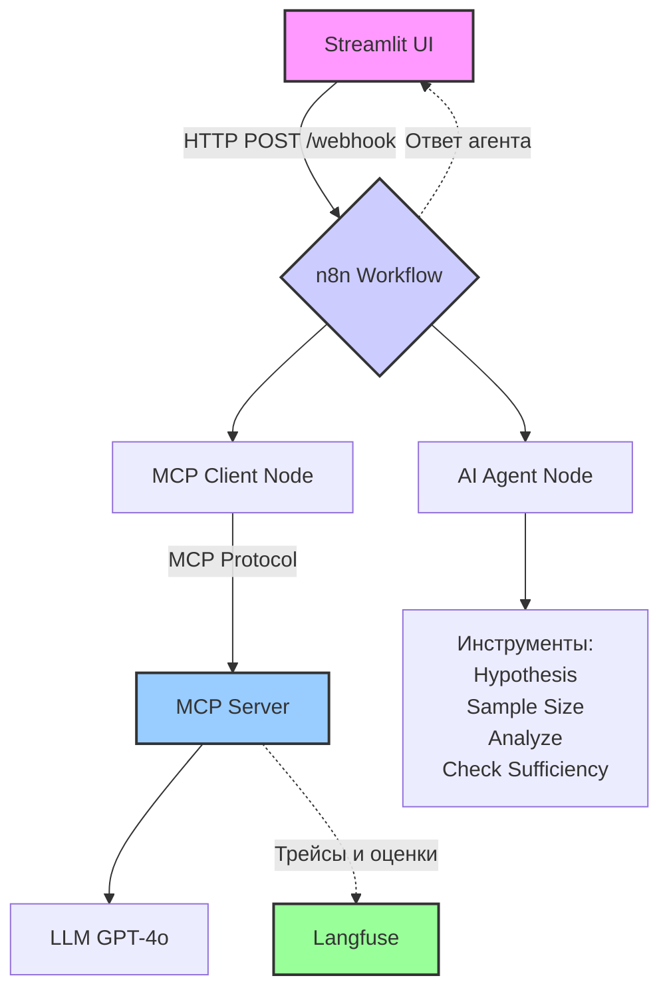

# Prolect_T-AI_in_analytics
Проект для бакалавриата ТБанка курса: ИИ в аналитике

Проект: **A/B Test Assistant — AI-ассистент, который проводит пользователя через все этапы A/B-тестирования. В решении вы найдете готовую архитектуру, код всех компонентов и подробную документацию, как это развернуть и протестировать.**

Для этого проекта я подготовил комплексное решение: **A/B Test Assistant** — AI-ассистент, который проводит пользователя через все этапы A/B-тестирования. В ответе вы найдете готовую архитектуру, код всех компонентов и подробную документацию, как это развернуть и протестировать.

---

## 1. Бизнес-обоснование и продуктовая гипотеза

### 1.1 Выделенная боль, решаемая продуктом

Проведение A/B-тестов требует специальных статистических знаний. Многие продуктовые менеджеры и маркетологи:

*   Не знают, как правильно сформулировать статистическую гипотезу (H₀ и H₁).
*   Допускают ошибки при расчете размера выборки, что приводит к недостоверным результатам.
*   Неверно интерпретируют p-value и статистическую значимость, делая ложные бизнес-выводы.

### 1.2 Продуктовая гипотеза: AS IS vs TO BE

**AS IS (Текущий процесс):**
1.  Аналитик вручную ищет информацию о том, как рассчитать выборку (онлайн-калькуляторы, статьи).
2.  Формулирует гипотезу в свободной форме, часто упуская статистическую строгость.
3.  После сбора данных вручную вносит цифры в Excel или онлайн-калькулятор для проверки значимости.
4.  Интерпретирует результат, часто полагаясь на интуицию, а не на строгие правила.

**TO BE (Процесс с нашим ассистентом):**
1.  Пользователь описывает идею теста на естественном языке в веб-интерфейсе Streamlit.
2.  Ассистент (AI Agent) переводит описание в строгую статистическую гипотезу.
3.  Автоматически рассчитывает необходимый размер выборки на основе введенных параметров (базовая конверсия, MDE, мощность, уровень значимости).
4.  После ввода результатов теста ассистент проводит статистический анализ и выдает готовую интерпретацию: "Эффект статистически значим, можно внедрять" или "Эффект не обнаружен, гипотезу отклоняем".

### 1.3 Примерная оценка улучшения/экономии в целевой метрике

*   **Целевая метрика:** Время, затрачиваемое на корректное планирование и анализ одного A/B-теста.
*   **AS IS:** ~2-3 часа на тест (поиск информации, расчеты вручную, консультации с аналитиком).
*   **TO BE:** ~15-20 минут на тест (описание идеи, получение готовых расчетов и интерпретации).
*   **Эффект:** **Сокращение времени на ~85-90%**. При 10 тестах в месяц это экономит ~25 часов работы, что эквивалентно ~3 рабочим дням.

---обнаружен, гипотезу отклоняем".

### 1.3 Примерная оценка улучшения/экономии в целевой метрике

*   **Целевая метрика:** Время, затрачиваемое на корректное планирование и анализ одного A/B-теста.
*   **AS IS:** ~2-3 часа на тест (поиск информации, расчеты вручную, консультации с аналитиком).
*   **TO BE:** ~15-20 минут на тест (описание идеи, получение готовых расчетов и интерпретации).
*   **Эффект:** **Сокращение времени на ~85-90%**. При 10 тестах в месяц это экономит ~25 часов работы, что эквивалентно ~3 рабочим дням.

## 2. Техническая архитектура и реализация

Система построена вокруг **n8n** как основного оркестратора. Пользовательский интерфейс реализован на **Streamlit**. Взаимодействие с AI-агентом происходит через **MCP сервер** (Model Context Protocol), а мониторинг качества осуществляется с помощью **Langfuse**.

### 2.1 Общая архитектура

## Архитектура системы

Система A/B Test Assistant построена как агентский конвейер, состоящий из четырёх ключевых компонентов:

| Компонент | Назначение | Технологии |
|-----------|------------|------------|
| **Streamlit UI** | Пользовательский интерфейс в виде чата. Отправляет запросы в n8n и отображает ответы ассистента. | Streamlit, Requests |
| **n8n Workflow** | Оркестратор агента. Принимает запрос, вызывает AI Agent с доступом к MCP-инструментам и возвращает ответ. | n8n, AI Agent Node, MCP Client Node |
| **MCP Server** | Предоставляет статистические инструменты для агента (расчёт выборки, анализ результатов и т.д.). Логирует вызовы в Langfuse. | Python, FastMCP, SciPy, Langfuse SDK |
| **Langfuse** | Платформа observability. Хранит трейсы, метрики и оценки качества для мониторинга и анализа. | Langfuse (Docker) |

### Диаграмма взаимодействия



---
### 2.2 Компоненты системы (реализация)

#### Компонент 1: MCP сервер на Python (FastMCP)

MCP сервер предоставляет инструменты для AI-агента. Он написан с использованием официального Python SDK для MCP. Мы используем библиотеку `FastMCP`, которая упрощает создание сервера и объявление инструментов через декораторы.

#### Компонент 2: Пользовательский интерфейс на Streamlit

Интерфейс реализован в виде чата в веб-приложении Streamlit. Он отправляет запросы к n8n через Webhook и отображает ответы ассистента.

#### Компонент 3: Оркестрация и интеграция через n8n

n8n выступает в роли "мозга" агентской системы. Он принимает запрос от Streamlit UI, обрабатывает его с помощью AI Agent Node и вызывает нужные инструменты через MCP Client.

**Как это работает:**
1.  В n8n создается workflow, который начинается с **Webhook** узла. Он слушает входящие POST-запросы от UI.
2.  Данные из запроса передаются в **AI Agent** узел. Этот узел подключен к LLM (например, OpenAI GPT-4o).
3.  В настройках AI Agent узла в качестве инструмента указан **MCP Client** узел. Этот клиент подключается к вашему MCP серверу, запущенному локально (например, по URL `http://localhost:8080/mcp`).
4.  Когда пользователь задает вопрос, AI Agent анализирует его и решает, какой инструмент MCP нужно вызвать (например, `calculate_sample_size`).
5.  MCP Client отправляет запрос на сервер, получает результат и возвращает его агенту.
6.  AI Agent на основе этого результата формулирует финальный ответ и отправляет его обратно в UI через **Webhook Response** узел.

#### Компонент 4: Логирование и мониторинг с Langfuse

Для выполнения требований по логированию и оценке качества (evaлы) мы используем **Langfuse** — платформу для observability LLM-приложений. Она позволяет отслеживать все вызовы LLM, логировать запросы и ответы, а также собирать метрики качества.

В нашем коде MCP сервера уже интегрировано логирование с помощью декоратора `@log_to_langfuse`. Дополнительно можно добавить логирование непосредственно в n8n через соответствующий узел Langfuse (но в базовой версии достаточно логирования со стороны MCP).

**Локальный запуск Langfuse:**
```bash
git clone https://github.com/langfuse/langfuse.git
cd langfuse
docker compose up -d
```
После этого интерфейс Langfuse будет доступен по адресу `http://localhost:3000`.

#### Компонент 4: Логирование и мониторинг с Langfuse

Для выполнения требований по логированию и оценке качества (evaлы) мы используем **Langfuse** — платформу для observability LLM-приложений. Она позволяет отслеживать все вызовы LLM, логировать запросы и ответы, а также собирать метрики качества.

В нашем коде MCP сервера уже интегрировано логирование с помощью декоратора `@log_to_langfuse`. Дополнительно можно добавить логирование непосредственно в n8n через соответствующий узел Langfuse (но в базовой версии достаточно логирования со стороны MCP).

**Локальный запуск Langfuse:**
```bash
git clone https://github.com/langfuse/langfuse.git
cd langfuse
docker compose up -d
```
После этого интерфейс Langfuse будет доступен по адресу `http://localhost:3000`.

#### Компонент 5: Оценка качества (Evals)

В проекте реализованы два типа оценки, как того требует задание:

**1. Оффлайн-оценка на бенчмарках (эталонах) с LLM as a Judge:**
Создадим скрипт `evals/offline_eval.py`, который сравнивает несколько вариантов промптов и настроек агента.

**2. Онлайн-оценка качества и алерты:**
В production-режиме система будет непрерывно оценивать качество ответов. Для этого в Langfuse настроены автоматические дашборды, отслеживающие:
- **Качество ответов:** средний балл `llm_judge_score`.
- **Стабильность:** процент успешных вызовов инструментов (метрика `tool_call_success`).
- **Латентность:** время ответа агента.

При падении ключевых метрик (например, `tool_call_success` ниже 95%) можно настроить алерты через интеграции Langfuse (Slack, email).

---

